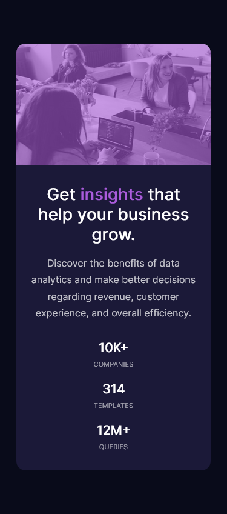

# Frontend Mentor - Stats preview card component solution

This is a solution to the [Stats preview card component challenge on Frontend Mentor](https://www.frontendmentor.io/challenges/stats-preview-card-component-8JqbgoU62). Frontend Mentor challenges help you improve your coding skills by building realistic projects. 

## Table of contents

- [Overview](#overview)
  - [The challenge](#the-challenge)
  - [Screenshot](#screenshot)
  - [Links](#links)
- [My process](#my-process)
  - [Built with](#built-with)
  - [What I learned](#what-i-learned)
  - [Continued development](#continued-development)
  - [Useful resources](#useful-resources)
- [Author](#author)
- [Acknowledgments](#acknowledgments)


## Overview

### The challenge

Users should be able to:

- View the optimal layout depending on their device's screen size

### Screenshot




### Links

- Solution URL: [solution URL here](https://www.frontendmentor.io/solutions/mobile-first-using-sass-O3opnbAMy)
- Live Site URL: [live site URL here](https://determined-panini-c0a69d.netlify.app/)

## My process

### Built with

- Semantic HTML5 markup
- CSS custom properties using Sass
- Mobile-first workflow


### What I learned

I learned how to apply custom overlay color in an image, positioning html elements and apply custom css properties using Sass while working thrrough this project.


```css
.image-header {
  height: 200px;
  max-width: 100%;
  background: url(../images/image-header-mobile.jpg);
  position: relative;
  background-size: 100% 100%;

  .image-header-overlay {
      position: absolute;
      height: 100%;
      width: 100%;
      background: hsl(277, 64%, 61%);
      opacity: 0.6;
  }
}
```

### Continued development

I want to continue focusing in CSS style in future projects.

### Useful resources

- [resource 1](https://www.w3schools.com/) - This helped me for the basic HTML and CSS. I really liked this website because its like the dictionary of web development.
- [resourse 2](https://www.youtube.com/watch?v=OvRL3PljUuI) - This helped me for the image overlay.
- [resourse 3](https://www.freecodecamp.org/news/learn-the-basics-of-git-in-under-10-minutes-da548267cc91/) - Basic Git tutorial.
- [resource 4](https://docs.github.com/en/github/authenticating-to-github/about-ssh) - connecting to github with ssh


## Author

- Website - [Evan Ross](https://www.your-site.com)
- Frontend Mentor - [@AnAiFa](https://www.frontendmentor.io/profile/AnAiFa)
- Twitter - [@aevanross](https://www.twitter.com/aevanross)


## Acknowledgments

I want to give credit to garnattione for his video solution ini
This is where you can give a hat tip to anyone who helped you out on this project. Perhaps you worked in a team or got some inspiration from someone else's solution. This is the perfect place to give them some credit.

